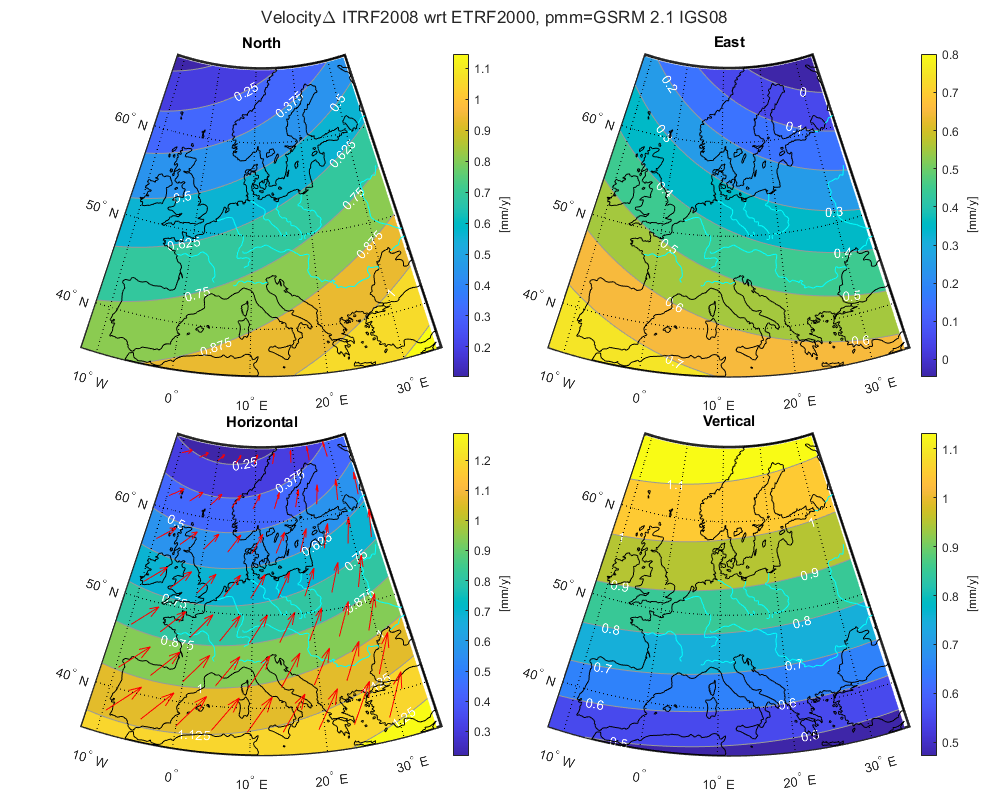

International Terrestrial Reference Frame (ITRF) Matlab Toolbox
===============================================================

**Version 1.2 (26 May 2025).**
 
Coordinate transformations between different ITRS and ETRS89 realizations.
--------------------------------------------------------------------------

## Synopsis

Coordinate and velocity transformations between International and European Terrestrial Reference 
Frame (ITRF/ETRF) realizations, plate motion models (PMM) and analysis of velocity and coordinate 
changes between reference frames.
 
> crdvelout=itrf2itrf(crdvelin,from,to,yearin,yearout)  
> crdout=itrf2itrf(crdin,from,to,yearin)  

> demoitrfmap  

## Functions

**Main functions**
 
    itrf2itrf  - Transform coordinates/velocities between various ITRF's and ETRF2000, ETRF2014 and ETRF2020.  
    pmmvel     - Get velocity from Plate Motion Model parameters.  
    itrfmap    - Plot map of velocity and coordinate changes between ITRF/ETRF.  

**Other functions**

    itrftp     - Get ITRF transformation parameters at a certain epoch  
    itrftables - Print table with transformation parameters between ITRF's.    
    itrf2etrf  - Transform coordinates/velocities between ITRFyy and ETRFyy.  
 
**Support functions**

    itrftpdef  - Define ITRF transformation parameters   
    etrftpdef  - Define ETRF transformation parameters   
    pmmpar     - Define Plate Motion Model parameters.     
    dijkstra   - Find shortest path in a graph using Dijkstra's algorithm  
    trafo3d    - 3D similarity transformation with 7 or 14 parameters  

**Demo/test scripts**

    demoitrfmap- Demo with itrfmap mapping velocity/coordinate changes  
    liveitrfmap- Live editor (.mlx) itrfmap analysis tool  
    testitrf   - Test itrf2itrf using actual ITRF coordinates  
    testpmm    - Test Plate Model Motion (PMM) functions  
 
## Notes

(1) itrf2itrf supports also transformations between ITRFyy and ETRF2000, ETRF2014 and ETRF2020.  

(2) itrf2etrf only supports transformations between ITRFyy and ETRFyy, or vice versa, for the same year.  

    crdvelout=itrf2etrf(crdvelin,from,to,yearin,yearout)  
    crdout=itrf2etrf(crdin,from,to,yearin)  

itrf2etrs is only useful for legacy ETRF. For operations involving ETRF2000, ETRF2014 and ETRF2020 you are better off with itrf2itrf.  
To preform transformations between legacy ETRF split the transform in two steps, e.g.  

            ITRFxx -> ETRFxx         itrf2etrf  
            ETRFxx -> ITRFxx         itrf2etrf  
            ITRFxx -> ETRFyy  :  
                ITRFxx -> ITRFyy     itrf2itrf  
                ITRFyy -> ETRFyy     itrf2etrf  
            ETRFxx -> ITRFyy  :  
                ETRFxx -> ITRFxx     itrf2etrf  
                ITRFxx -> ITRFyy     itrf2itrf  
            ETRFxx -> ETRFyy  :  
                ETRFxx -> ITRFxx     itrf2etrf  
                ITRFxx -> ITRFyy     itrf2itrf  
                ITRFyy -> ETRFyy     itrf2etrf  

(3) Dijkstra's algorithm to find the shortest path is used to construct all possible combinations of transformations.  

## Examples
 
    crdvelout=itrf2itrf(  ...  
      [  3899225.258   396731.815  5015078.341    -.0130    .0158    .0092 ; ...  
         3812141.404   395731.729  4995987.219     .0004   -.0013    .0002 ],...   
      'ITRF2005','ITRF2000',2008.4,2000.0)  

    crdout=itrf2itrf(  ...  
      [  3899225.258   396731.815  5015078.341  ; ...  
         3812141.404   395731.729  4995987.219  ],...   
      'ITRF2005','ITRF2000',2008.4)  

    crdvelout=itrf2itrf(  ...  
      [3924687.552  301132.856  5001910.904 -.0150 .0164 .0070], ...  
      'ITRF2000','ETRF2000',1997.0,1989.0)  

## License notice

The following notice applies to all Matlab functions and scripts in this repository.

Copyright 2012-2025 Hans van der Marel, Delft University of Technology.

Licensed under the Apache License, Version 2.0 (the "License");
you may not use this file except in compliance with the License.
You may obtain a copy of the License at http://www.apache.org/licenses/LICENSE-2.0 .
Unless required by applicable law or agreed to in writing, software
distributed under the License is distributed on an "AS IS" BASIS,
WITHOUT WARRANTIES OR CONDITIONS OF ANY KIND, either express or implied.
See the License for the specific language governing permissions and
limitations under the License.
